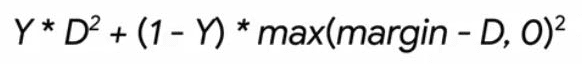
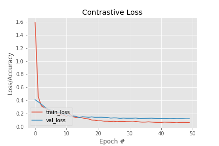

# 🧑face-verification-with-siamese-networks

<p align="center">
  
</p>

<p align="center">
  
</p>

### 📝Description
---
In this project, we are going to implement an End-to-End Deep Learning/Machine Learning project. What this web application does is that first, it gets two grayscale faces (that were extracted by the `Haar Cascade` face detection algorithm) from the user. As soon as the user clicks on the `Match` button, the model receives both faces, applies some image preprocessing actions on them, and then passes these two images into the model itself. Take note that this specific Siamese network receives two images as inputs and then applies `Contrastive Loss`, which we will discuss later on. In the next step, the model returns a number, which is the `distance` between two faces. If the distance is greater or equal to a specific threshold (in this case, the threshold is equal to `0.4`), then returns `Not Matched`; which means these two images **do not** belong to the same person. Otherwise, it returns `Matched`, which means these two faces belong to the same person.


### ⚡Face Recognition vs Face Detection vs Face Validation
---
Before we start and dig into this project, first, we have to comprehend some terminologies and their differences in the face field.

First of all, it has to be mentioned that face detection and face recognition are completely two different terminologies. With face detection, as its name suggests, we can detect and localize available face(s) in an image. The face detection algorithm tells you where is the face exactly in the image. On the other hand, a face recognition algorithm is a different algorithm. Face recognizer gets the ROI of the image where the face is exactly located in that specific region, and performs some actions on the ROI, and then identifies the person that this face belongs to. We have various methods to detect and extract face(s) in the image, some of them are `Haar Cascades`, OpenCV's deep learning-based face detector, `HOG + Linear SVM` etc.

The next terminology is `Face Verification` which is completely different from previous terminologies. In face verification, we select a face and then compare it to one or more other faces. By doing this, we receive two possible outputs from the model, `same` or `different`. But in face recognition, the output is the name or ground truth of the recognized face.

### 📐Siamese Networks
---
Siamese Networks are a type of neural network architecture that consists of two or more convolutional neural networks (CNNs) that work in parallel. We call these CNNs subnetworks. All of the subnetworks are identical. In addition to this, these subnetworks have the same parameters, architecture, and weights. Any parameter updates are **mirrored** across both subnetworks. This means that if the weights of one of the subnetworks are updated, then the weights of all of the other networks will be updated as well.

As mentioned, each subnetwork consists of a CNN network. Each CNN network receives a grayscale face image with a shape of `(62, 47, 1)` with a batch size of 4. Then the input process into these `Conv2D => BN => ReLU => Pooling` sequence, and then it is converted into a `48-d` vector by a `GlobalMaxPooling` layer. After this process, these networks return the vector to be able to calculate the `Euclidean distance` between vectors and do further processing.

For the loss function, `Contrastive Loss` is used. The reason is that in many ways, this loss function outperforms and has more accurate results than `Binary Cross-Entropy`. The contrastive loss function is calculated by the formula below:

<p align="center">
  
</p>

### 📉Project Results
---
The model has been created and put into a web application, and you can see the performance and the output of the model below:


---


In addition to this, you can observe the loss function of the model for both training and test set:

<p align="center">
  
</p>

### 🖥 Installation
---
The Code is written in Python 3.7.5. If you don't have Python installed, you can find it [here](https://www.python.org/downloads/). If you are using a lower version of Python, you can upgrade using the pip package to ensure you have the latest version of pip. To install the required packages and libraries, run this command in the project directory after cloning the repository:
```
git clone git@github.com:Kasra1377/lbp-face-recognition.git
```
or
```
git clone https://github.com/Kasra1377/lbp-face-recognition.git
```
After you clone this repository, you have to download and install the Anaconda. You can find the download link from this [link](https://www.anaconda.com/products/individual). After the installation, open the Anaconda Prompt and type the code down below:
```
conda create -n verification python=3.7
```
This command creates a virtual env with the name `verification`. Note that you can choose your own arbitrary name for the virtual environment. After the virtual environment is created,  switch to the directory of the project folder via Anaconda Prompt and then type:

```
conda activate verification
```
This command activates the virtual environment that you have just created. To install all of the libraries used in this project, you have to type:
```
conda install file requirements.txt
```

By doing this and downloading all of the required packages, you are ready to run this project on your local computer.

To run the web app on your computer, first open the `app.py` python file by your own IDE and switch from the current virtual env of your IDE into your newly created virtual environment. After that, open your Git Bash and type the following commands respectively:

```
export FLASK_APP=app.py
```

```
export FLASK_ENV=development
```

```
FLASK_DEBUG=1 flask run
```

Now, the web app is opened in your browser locally. You can use the available cropped faces in the `samples` folder; to upload and match the faces.

### 🛠Technologies Used
---
**IDE**:  


**Language(s):**  

**Libraries:**       

**Front-End:**     

**Backend:**  

**Others:** 

### ❌Bugs & Issues
---
If you ever encounter any bugs or technical issues in this project, you can report it by the `issues` section of this repository, or you can contact me by my email address. 

### 👥Contributers
---
Kasra1377

### 🔻References
---
[Building image pairs for siamese networks with Python](https://www.pyimagesearch.com/2020/11/23/building-image-pairs-for-siamese-networks-with-python/)

[Contrastive Loss for Siamese Networks with Keras and TensorFlow](https://www.pyimagesearch.com/2021/01/18/contrastive-loss-for-siamese-networks-with-keras-and-tensorflow/)

